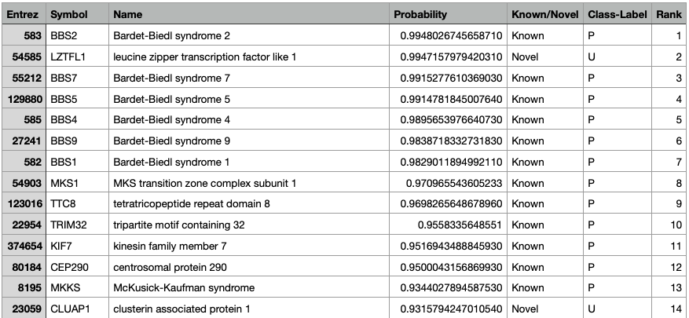
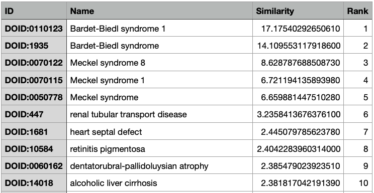
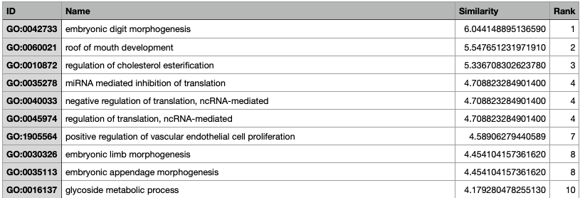

Illustrative Example
====================

An example of biological insights achievable from PyGenePlexus can be illustrated by looking at genes associated with Bardet-Biedl syndrome 1 in the DisGeNet database. The example below utilizes BioGRID as the network, embeddings as the feature representation and selecting negative genes based on similar diseases. When looking at the genome-wide predictions from PyGenePlexus (Table 1), the gene LZTFL1 (leucine zipper transcription factor like 1) was originally not in the list of associated genes is predicted with the second highest probability, and there is evidence that LZTFL1 has a role in Bardet-Biedl syndrome 1. Comparing the model trained on Bardet-Biedl syndrome 1 genes to model trained on known disease gene set (Table 2) shows that model is highly similar to Meckel syndrome (both 8 and 1), which is a disease highly related to Bardet-Biedl syndrome 1. Comparison of the Bardet-Biedl syndrome 1 model to models trained on gene sets from known biological process the top ten results are terms relating to polydactylism, cholesterol and glycoside processes, and retina homeostasis, which relate to manifestations of Bardet-Biedl syndrome 1 such as blindness, obesity and having extra fingers or toes (Table 3).

  Table 1: The caption for the probs figure

  Table 2: The caption for the DOID figure

  Table 3: The caption for the GO figure

