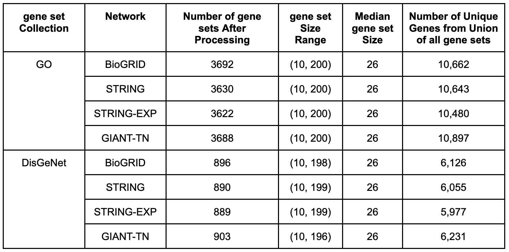

Processing gene set collections
===============================

PyGenePlexus uses two different gene set collections and the properties of these collections can be seen in the table below. First, is a gene set collection that maps genes to various biological processes found in the [GO]_. To build this gene set collection we retrieved gene to biological processes annotations from [MyGeneInfo]_ (downloaded on 2020-10-29) for any human gene that had an Entrez ID, where the annotations were subset to only include the following evidence codes; EXP, IDA, IPI, IMP, IGI, TAS, and IC. These annotations were propagated up the ontology, i.e. if a gene was annotated to a term, we then also annotated it to every ancestor term, where the ontology structure only included biological process terms. The other collection maps genes to various diseases. This mapping was downloaded directly from the [DisGeNet]_ database (downloaded on 2020-11-23), and we also propagated the gene-disease annotations to ancestor nodes using the [DiseaseOntology]_.

Each collection was also further processed separately for each network by first finding the intersection between the genes in a given network and the genes annotated to a term in the gene set collection. If the length of this intersection was between 10 and 200 the gene set was retained. After having gone through every term in the collection, we additionally keep track of all genes that are annotated to at least one term in this subset version of the gene set collection. This set of total genes is used when determining which genes to use as negative examples in the machine learning model.

  Table S2. Information on the gene set collections. The last four columns reflect the fact each gene set collection is slightly different for every network and these values are presented as either a range, a median value, or number of genes in a union.

