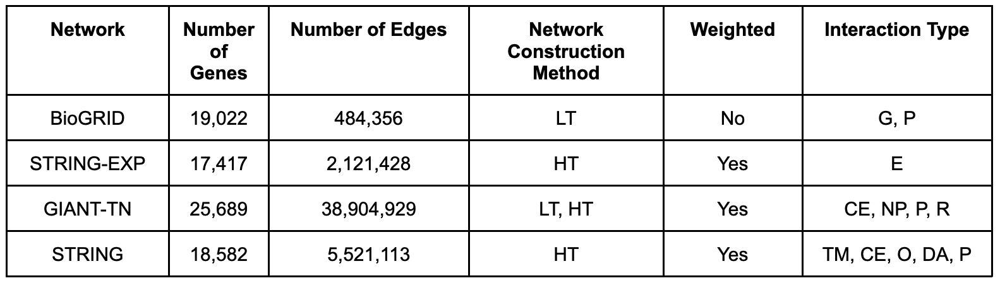
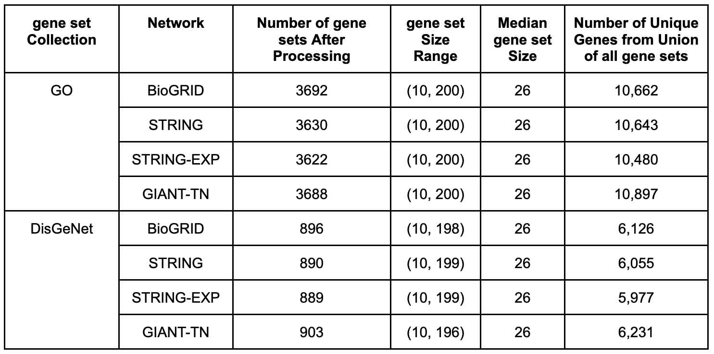

Network and gene set collection data
====================================

Construction of the networks
----------------------------

The pre-processed networks are [BioGRID]_, [STRING]_ and [GIANT-TN]_. Detailed
information about the network properties and sources can be seen in the table
below, with the network construction method and interaction type information
coming from [Huang]_ et. al.. BioGRID (version 4.2.191) is a low-throughput
network that includes both genetic interactions, as well as physical
protein-protein interactions. STRING (version 11.0) is a high-throughput,
scored network that aggregates information from many data sources. We used two
different STRING networks. First, we used the “combined” network that directly
includes database annotations, text-mining, ortholog information,
co-expression, and experimental determined interactions (referred to as
“STRING”). We also used a subset of edges in STRING that had just the
“experiments” data, thus restricting the network to one constructed just from
experimental determined interactions in humans (referred to as “STRING-EXP”).
For both networks, we used the corresponding relationship scores as edge
weights, after scaling them to lie between 0 and 1. The GIANT-TN (version 1.0)
network is the tissue-naïve network from GIANT, referred to as the “Global”
network on the HumanBase website, and is constructed from both low- and
high-throughput data, and includes information from co-expression, non-protein
sources, regulatory data, and physical protein-protein interactions. The
GIANT-TN network is a fully connected, scored network. To add sparsity to the
GIANT-TN network, we removed all edges with scores below 0.01 (equal to the
prior in the Bayesian model used to construct the network). We used all edge
scores (weights) unless otherwise noted, and the nodes in all networks were
mapped into Entrez genes using the [MyGeneInfo]_ database. If the original node
ID mapped to multiple Entrez IDs, we added edges between all possible mappings.

  Table S1. Information on the molecular networks. LT: low-throughput,
  HT: high-throughput, G: genetic, P: physical, E: Experimentally determined,
  DA: database annotations, CE: co-expression, NP: non-protein, R: regulation,
  TM: text-mining, O: orthologous.

Network Representations
-----------------------

We utilize three distinct representations of molecular networks: the adjacency
matrix, an :term:`influence` matrix, and low-dimensional node embeddings.
Let :math:`G = (V,E,w)` denote an undirected molecular network, where :math:`V`
is the set of vertices (genes), :math:`E` is the set of edges (associations
between genes), and :math:`w: V \times V \rightarrow [0, 1]` is the edge weight
function (the strengths of the associations). :math:`G` can be represented as a
weighted adjacency matrix :math:`A_{i,j}=w(i,j)`, where
:math:`A \in R^{|V| \times |V|}`. :math:`G` can also be represented as an
:term:`influence` matrix, :math:`F \in R^{|V| \times |V|}`, which can capture
both local and global structure of the network. :math:`F` was obtained using a
random walk with restart transformation kernel,

.. math::
   F = \alpha (I - (1 - \alpha) W_D)^{-1}

where :math:`\alpha` is the restart parameter, :math:`I` is the identity
matrix, and :math:`W_D` is the degree weighted adjacency matrix given by
:math:`W_D = A D^{-1}`, where :math:`D \in R^{|V| \times V}` is a diagonal
matrix of node degrees. A restart parameter of 0.85 was used for every network.

:math:`G` can also be transformed into a low-dimensional representation through
the process of node embedding. In this study we used the [node2vec]_ algorithm,
which borrows ideas from the word2vec algorithm from natural language
processing. The objective of *node2vec* is to find a low-dimensional
representation of the adjacency matrix, :math:`E \in R^{|V| \times d}`,
where :math:`d \ll |V|`. This is done by optimizing the following
log-probability objective function:

.. math::
   E = \arg\min_E \sum_{u \in |V|}{log(Pr(N_{s}(u)|e(u)))}

where :math:`N_{s}(u)` is the network neighborhood of node :math:`u` generated
through a sampling strategy :math:`S`, and :math:`e(u) \in R^{d}` is the
feature vector of node :math:`u`. In *node2vec*, the sampling strategy is based
on random walks that are controlled using two parameters :math:`p` and
:math:`q`, in which a high value of :math:`q` keeps the walk local (a
breadth-first search), and a high value of :math:`p` encourages outward
exploration (a depth-first search). The values of :math:`p` and :math:`q`
were both set to 0.1 for every network.

Processing gene set collections
-------------------------------

PyGenePlexus uses two different gene set collections and the properties of
these collections can be seen in the table below. First, is a gene set
collection that maps genes to various biological processes found in the [GO]_.
To build this gene set collection we retrieved gene to biological processes
annotations from [MyGeneInfo]_ (downloaded on 2020-10-29) for any human gene
that had an Entrez ID, where the annotations were subset to only include the
following evidence codes; EXP, IDA, IPI, IMP, IGI, TAS, and IC. These
annotations were propagated up the ontology, i.e. if a gene was annotated to a
term, we then also annotated it to every ancestor term, where the ontology
structure only included biological process terms. The other collection maps
genes to various diseases. This mapping was downloaded directly from the
[DisGeNet]_ database (downloaded on 2020-11-23), and we also propagated the
gene-disease annotations to ancestor nodes using the [DiseaseOntology]_.

Each collection was also further processed separately for each network by first
finding the intersection between the genes in a given network and the genes
annotated to a term in the gene set collection. If the length of this
intersection was between 10 and 200 the gene set was retained. After having
gone through every term in the collection, we additionally keep track of all
genes that are annotated to at least one term in this subset version of the
gene set collection. This set of total genes is used when determining which
genes to use as negative examples in the machine learning model.

  Table S2. Information on the gene set collections. The last four columns
  reflect the fact each gene set collection is slightly different for every
  network and these values are presented as either a range, a median value, or
  number of genes in a union.

Determing Postitive and Negative Samples
----------------------------------------

PyGenePlexus uses a supervised machine learning model for predicting the
association of all the genes in the network to the user supplied gene set. To
build the classification boundary the model requires both positive and negative
training examples. The positive set of genes is any gene from the user-supplied
gene list that is able to be converted to an Entrez ID and found in the chosen
network. The user can then choose if they want to define genes in the negative
class based on one of two gene set collections, biological processes from the
[GO]_ or diseases from [DisGeNet]_, based on whether the input genes better
represent a cellular process/pathway or a disease. GenePlexus then
automatically selects the genes in the negative class by:

#. Consider the total pool of possible negative genes to be any gene that has
   an annotation to at least one of the terms in the selected gene set
   collection
#. Remove genes that are in the positive class.
#. For every term in a gene set collection, we perform a one-sided Fisher’s
   exact test between the genes in the positive class and the genes annotated
   to the given term. If the p-value of the test is less than 0.05, all genes
   from the given term are also removed from the pool of possible negative
   genes.
#. The remaining genes in the pool of possible negative genes are used in the
   negative class. Note that most genes in the network are not contained in the
   positive class or negative class and are considered as part of the unlabeled
   class.
