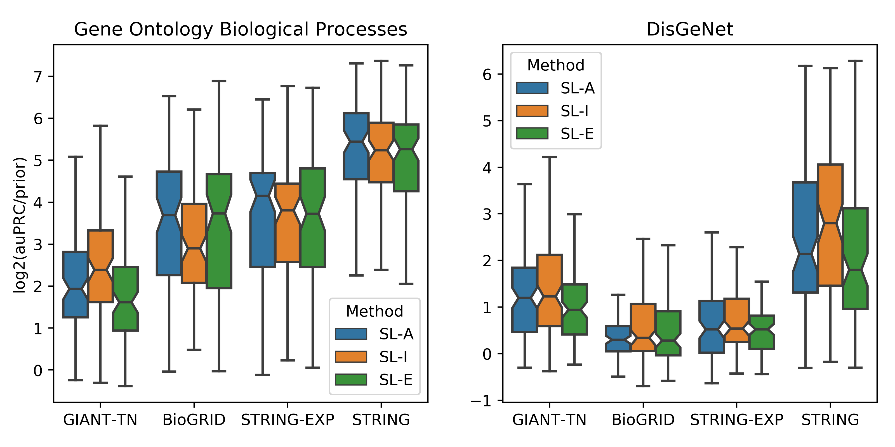

Guidelines for Selecting Parameters
===================================

#. The first step is choosing the **network**. If your gene set of interest
   comes from a curated database or it was generated while studying a specific
   process/pathway or disease, the best network to choose is STRING as this
   network is a highly curated network that uses prior knowledge from gene set
   databases in building the network. If you would like to only consider
   experimental interactions, then the network to use is STRING-EXP, and if you
   would further only like to consider physical interactions, choose BioGRID.
   The GIANT-TN network is best to use for two cases. First, since it offers
   the highest gene coverage, it enables the user to see predictions on many
   more understudied genes. Second, as GIANT-TN is a very dense network that
   does not directly incorporate gene set database information, this network
   performs well on larger gene sets that may be derived from high-throughput
   experiments.

#. The next step is to choose the way the network is represented as
   **features** in the machine learning model.

   * For BioGIRD, using Adjacency or Embedding usually results very similar
     performance

   * For STRING-EXP, using Adjacency is usually the best feature
     representation.

   * For GIANT-TN, Influence is usually the best representation.

   * For STRING, if your input gene set size is smaller or if the gene set is
     similar to a specific biological process, then using Adjacency is the
     best choice. If the gene set size is larger or if the gene set
     corresponds to a complex phenotype, then use Influence.

#. The final step is to choose the **background** used to determine the genes
   used as negative examples in the machine learning model. If your gene set
   corresponds to a biological process or pathway, choose GO. Instead, if it
   corresponds more closely to a disease or a complex phenotype, then choose
   DisGeNet.

The above figure displays results from the [GenePlexus]_ paper *Supervised
learning is an accurate method for network-based gene classification* where the
parameters are options in the GenePlexus webserver. The left panel is for
models trained for Gene Ontology biological prcoesses and the right panel is
for models trained for DisGeNet diseases. Each boxplot contains the results of
anywhere between 89 and 160 models. Each model was trained using the study-bias
holdout method, where for each geneset in a geneset collection, the most well
studied genes were used to train the model and the least studied genes were
used for testing. This figure can be used to help users pick the network,
feature type and negative selection class that best suits their input gene
list. It is worth noting that the STRING network is built in part by using
Gene Ontology and DisGeNet annotations, and this circularity could be the
reason for the enhanced performance of the STRING network in this evaluation.
